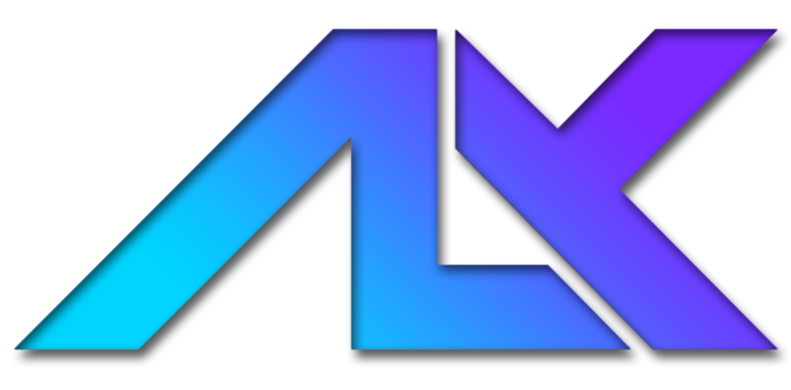

# AI Toolbox


A robust, high-performance asset manager designed specifically for the AI image generation ecosystem. It unifies metadata parsing across fragmented formats, providing **SQL-backed search**, **collections**, **live folder monitoring**, and **deep node inspection** in a modern, dark-themed web interface.

---

## 📸 Interface

### Core Workflow
| Library Browser | Speed Sorter ⚡ |
|:---:|:---:|
|  |  |
| *Grid Gallery with Live Monitoring* | *Rapid Organization with Keyboard Shortcuts* |

### Metadata & Inspection
| Metadata Sidebar | Deep Inspection |
|:---:|:---:|
|  |  |
| *Unified Parameter Display & Ratings* | *High-Res Zoom & Pan* |

<details>
<summary><b>View Advanced Features</b></summary>
<br>

| Raw Data View | Search & Filtering |
|:---:|:---:|
|  |  |
| *Underlying JSON/Parameter Blocks* | *Instant Search* |

</details>

---

## 🔐 Portable, Private & Secure

Designed for the privacy-conscious artist, this application operates on a strictly "Local-First" philosophy.

* **Local Web Server:** The application runs as a local web server on your machine.
* **100% Offline / No Telemetry:** There are no "cloud sync" features, analytics, or background API calls. Your prompts and generation data never leave your machine.
* **Privacy Scrubbing:** The integrated **Scrubber View** allows you to sanitize images before sharing them on social media. It strips hidden generation metadata (Prompts, ComfyUI Workflows, Seed data) while preserving the visual image quality.

---

## ✨ Key Features

* **Universal Metadata Engine:** Advanced parsing strategies for the entire stable diffusion ecosystem.
  * **ComfyUI:** Traverses complex node graphs (recursive inputs) and API formats to identify the true Sampler, Scheduler, and LoRAs used.
  * **Automatic1111 / Forge:** Robust parsing of standard "Steps: XX, Sampler: XX" text blocks.
  * **Others:** Native support for **InvokeAI**, **SwarmUI**, and **NovelAI**.
* **Library Management:**
  * **Collections:** Create virtual collections to organize images across different folders without moving files.
  * **Pinned Folders:** Bookmark frequently accessed directories for quick navigation.
  * **Star Ratings:** Rate images (1-5 stars) and filter/sort by rating.
* **Speed Sorting:** A dedicated mode for processing high-volume generation batches.
  * **Hotkeys:** Instantly move images to configurable target folders or collections.
  * **Recycle Bin:** Safely move unwanted results to the OS trash.
* **Performance:**
  * **Live Monitoring:** Automatically detects and indexes file additions or deletions in real-time.
  * **Virtualization:** Uses virtual scrolling to handle folders with thousands of images without performance degradation.
  * **Background Indexing:** Dedicated non-blocking threads process metadata extraction to keep the UI buttery smooth.
* **Modern UX:**
  * **Dark Theme:** "Deep Neon Cinematic" CSS styling for a professional look.
  * **Responsive:** Works on desktop and mobile browsers within your local network.

---

## 🛠️ Technical Architecture

The application is built as a modern web application with a Spring Boot backend and a Vue.js frontend.

* **Backend (Java 21 + Spring Boot):**
  * **REST API:** Exposes endpoints for file management, metadata extraction, and system operations.
  * **SQLite:** Uses SQLite to store metadata index and collections.
  * **Metadata Extractor:** Uses `metadata-extractor` library for robust EXIF/PNG chunk parsing.
  * **Virtual Threads:** Leverages Java 21 virtual threads for high-concurrency I/O operations.

* **Frontend (Vue 3 + PrimeVue):**
  * **Vite:** Fast build tool and development server.
  * **Pinia:** State management for the application.
  * **PrimeVue:** Comprehensive UI component library.
  * **Axios:** HTTP client for API communication.

---

## 🚀 Getting Started

### Prerequisites
* Java 21 or higher
* Node.js 18 or higher (for frontend development)

### Running the Application

1. **Backend:**
   ```bash
   cd backend
   ./mvnw spring-boot:run
   ```

2. **Frontend:**
   ```bash
   cd frontend
   npm install
   npm run dev
   ```

3. Open your browser and navigate to `http://localhost:5173`.

---

## 📜 License

Distributed under the **MIT License**. Free for personal and commercial use.

---

## 💖 Support the Project

If the **AI Toolbox Web** has streamlined your workflow, consider supporting its ongoing development. Your contributions help maintain compatibility with new AI platforms and node structures.

[](https://github.com/sponsors/erroralex)
[](https://ko-fi.com/error_alex)

---

<p align="center">
  <b>Developed by</b><br>
  <br>
  Copyright (c) 2026 Alexander Nilsson
</p>